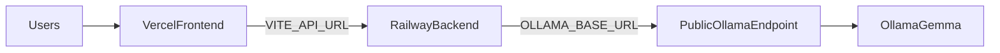

# Deployment Guide

Deploy the Gemma Chatbot for internal testing with:

- **Frontend** on Vercel
- **Backend** on Railway
- **Ollama** on your local machine, exposed via public IP



> **Security warning:** Exposing Ollama on a public port has no authentication. Use only for temporary internal testing. Restrict access via firewall rules where possible, and update `OLLAMA_BASE_URL` when your public IP changes.

## Prerequisites

1. Complete [LOCAL_OLLAMA_SETUP.md](./LOCAL_OLLAMA_SETUP.md) — Ollama running and reachable at `http://<PUBLIC_IP>:11434`
2. GitHub repository with this project pushed
3. [Railway](https://railway.app/) account
4. [Vercel](https://vercel.com/) account

## Step 1: Deploy backend to Railway

1. Create a new project in Railway and **Deploy from GitHub repo**.
2. Set the service **Root Directory** to `backend`.
3. Railway detects Python via Nixpacks and uses [`backend/railway.toml`](../backend/railway.toml).
4. Add environment variables:

| Variable | Example | Required |
|----------|---------|----------|
| `ENVIRONMENT` | `production` | Yes |
| `OLLAMA_BASE_URL` | `http://203.0.113.10:11434` | Yes |
| `GEMMA_MODEL` | `gemma4:e2b` | Yes |
| `CORS_ORIGINS` | `https://your-app.vercel.app` | Yes |
| `LOG_LEVEL` | `INFO` | No |
| `OLLAMA_REQUEST_TIMEOUT` | `120` | No |
| `OLLAMA_RETRY_ATTEMPTS` | `3` | No |
| `STARTUP_VALIDATE_OLLAMA` | `true` | No (defaults true in production) |
| `CORS_ORIGIN_PATTERN` | `https://.*\.vercel\.app` | No (for preview deploys) |

5. Deploy and wait for the build to finish.
6. Copy the public Railway URL (e.g. `https://gemma-chatbot-production.up.railway.app`).
7. Verify:
   - `GET https://<railway-url>/health` → `{"status":"healthy"}`
   - `GET https://<railway-url>/health/model` → Ollama reachable and model loaded

If deploy fails at startup, check Railway logs — usually Ollama is unreachable or the model is not pulled.

## Step 2: Deploy frontend to Vercel

1. Import the GitHub repo in Vercel.
2. Set **Root Directory** to `frontend`.
3. Framework preset: **Vite** (auto-detected).
4. Add environment variable:

| Variable | Value |
|----------|-------|
| `VITE_API_URL` | `https://<your-railway-url>` |

5. Deploy.
6. Copy the Vercel URL (e.g. `https://gemma-chatbot.vercel.app`).

## Step 3: Update CORS on Railway

Return to Railway and set `CORS_ORIGINS` to your Vercel URL:

```
CORS_ORIGINS=https://your-app.vercel.app
```

For Vercel preview deployments, optionally add:

```
CORS_ORIGIN_PATTERN=https://.*\.vercel\.app
```

Redeploy the backend if needed.

## Step 4: Verify deployment

From the project root:

```bash
BACKEND_URL=https://your-app.up.railway.app \
FRONTEND_URL=https://your-app.vercel.app \
python scripts/verify_deployment.py
```

Or with explicit args:

```bash
python scripts/verify_deployment.py \
  --backend-url https://your-app.up.railway.app \
  --frontend-url https://your-app.vercel.app
```

Open the Vercel URL in a browser and send a test message.

## Environment variable reference

### Backend (Railway)

| Variable | Default | Description |
|----------|---------|-------------|
| `OLLAMA_BASE_URL` | `http://localhost:11434` | Ollama API URL |
| `GEMMA_MODEL` | `gemma4:e2b` | Model name |
| `CORS_ORIGINS` | `http://localhost:5173` | Comma-separated allowed origins |
| `CORS_ORIGIN_PATTERN` | — | Optional regex for extra origins |
| `ENVIRONMENT` | `development` | `production` enables stricter defaults |
| `LOG_LEVEL` | `INFO` | Python log level |
| `PORT` | `8000` | Injected by Railway |
| `OLLAMA_REQUEST_TIMEOUT` | `120` | Request timeout (seconds) |
| `OLLAMA_RETRY_ATTEMPTS` | `3` | Retries for transient failures |
| `OLLAMA_RETRY_DELAY` | `1` | Base retry delay (seconds) |
| `STARTUP_VALIDATE_OLLAMA` | `true` in production | Exit if Ollama unreachable at boot |

### Frontend (Vercel)

| Variable | Description |
|----------|-------------|
| `VITE_API_URL` | Railway backend public URL |

## API endpoints

| Method | Path | Description |
|--------|------|-------------|
| GET | `/health` | Liveness check (Railway healthcheck) |
| GET | `/health/model` | Ollama connectivity and model status |
| POST | `/chat` | Non-streaming chat |
| POST | `/chat/stream` | SSE streaming chat |

## Troubleshooting

### Railway deploy fails immediately

- Confirm Ollama is running and port 11434 is forwarded.
- Test from another network: `curl http://<PUBLIC_IP>:11434/api/tags`
- Check `OLLAMA_BASE_URL` uses `http://` (not `https://`) and the correct IP.
- Ensure `gemma4:e2b` is pulled: `ollama pull gemma4:e2b`

### `/health/model` returns 503

- Ollama unreachable: check firewall, port forwarding, and that your PC is awake.
- Model not loaded: run `ollama pull gemma4:e2b` on the local machine.

### Frontend shows CORS errors

- Set `CORS_ORIGINS` on Railway to the exact Vercel URL (no trailing slash).
- Redeploy backend after changing env vars.

### Chat times out

- First request loads the model into GPU/RAM — can take 30+ seconds.
- Increase `OLLAMA_REQUEST_TIMEOUT` on Railway if needed.

### Public IP changed

- Update `OLLAMA_BASE_URL` on Railway with the new IP.
- Redeploy or restart the Railway service.

## Related docs

- [LOCAL_OLLAMA_SETUP.md](./LOCAL_OLLAMA_SETUP.md) — expose Ollama from your machine
- [DEPLOYMENT_CHECKLIST.md](./DEPLOYMENT_CHECKLIST.md) — step-by-step checklist
